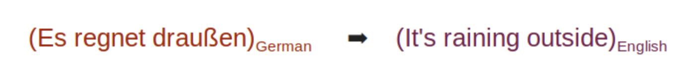
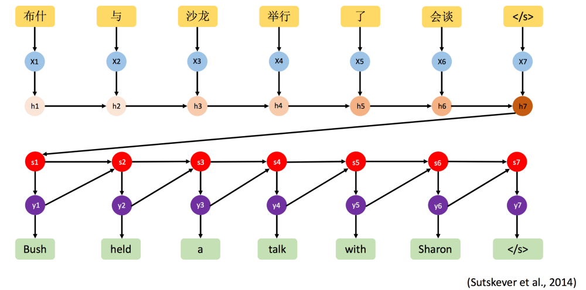
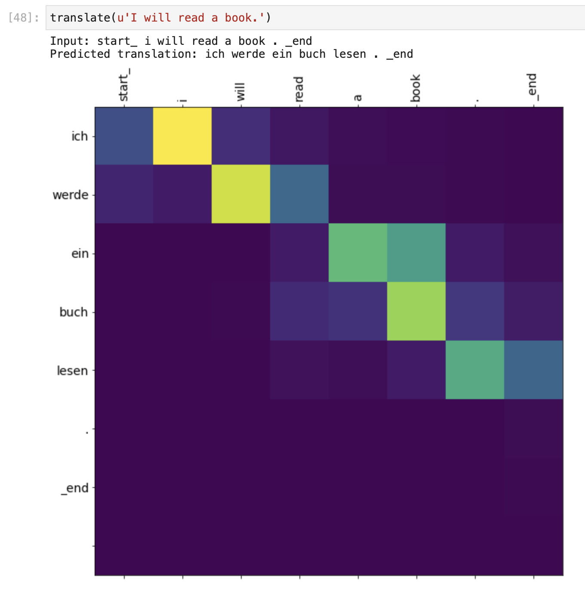
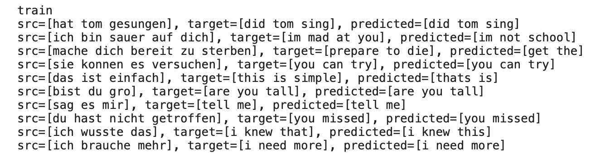
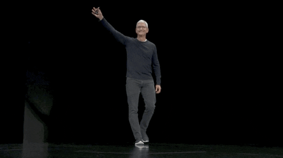

# Capstone - Neural Machine Translation
#### By [Anna Mitchell](https://anna-mitchell.com)

***
>"If you talk to a man in a language he understands, that goes to his head. If you talk to him in his own language, that goes to his heart."   ~ Nelson Mandela
***

Due to Github file size limitations, please use the following links to access the corresponding data for each model translation, which include: 

* final .pkl file
* train file
* test file
* model h.5
* model.yaml

### Link to Datasets (by presentation order, accessed via my personal CloudStorage API):
- [German](https://console.cloud.google.com/storage/browser/capstone_data;tab=objects?forceOnBucketsSortingFiltering=false&authuser=1&project=dauntless-gate-291813&supportedpurview=project&prefix=&forceOnObjectsSortingFiltering=false)
- [French](https://console.cloud.google.com/storage/browser/capstone_data/French?authuser=1&project=dauntless-gate-291813&supportedpurview=project&pageState=(%22StorageObjectListTable%22:(%22f%22:%22%255B%255D%22))&prefix=&forceOnObjectsSortingFiltering=false)
- [Italian](https://console.cloud.google.com/storage/browser/capstone_data/Italian?authuser=1&project=dauntless-gate-291813&supportedpurview=project&pageState=(%22StorageObjectListTable%22:(%22f%22:%22%255B%255D%22))&prefix=&forceOnObjectsSortingFiltering=false)
- [Portuguese](https://console.cloud.google.com/storage/browser/capstone_data/Portuguese?authuser=1&project=dauntless-gate-291813&supportedpurview=project&pageState=(%22StorageObjectListTable%22:(%22f%22:%22%255B%255D%22))&prefix=&forceOnObjectsSortingFiltering=false)

***

## Problem Statement
Convert a German (or other language) sentence to it's English counterpart using a Neural Machine Translation (NMT) system.

***

## Data Collection
All datasets were collected from http://www.manythings.org

***

## Preproccessing
* Convert text to lower case
* Remove quotes
* Clean digits from the source and target sentences. If the source or the target language use different symbols for the numbers, then remove those symbols
* Remove spaces
* Add a space between the word and the punctuations like "?"
* Add "start_" tag at the start of the sentence and "_end" tag at the end of the sentence 

***

## _There are two notebooks for each language. The first is a Sequence2Sequence model, the second is a Bahdanua Attention Model._

***

## Modeling with Sequence-to-Sequence(Seq2Seq) 
NMT is implemented using a Seq2Seq model consisting of Encoder and Decoder. The Encoder encodes the complete information of the source sequence into a single real-valued vector (or the context vector), which is passed to the Decoder to produce an output sequence, which is the target language of German (or French, Italian, or Portuguese). 

***

***

## Modeling with Bahdanua Attention 
_Think for a minute -  what would you pay attention to more: a news article, or the notes for a test tomorrow?_
_Of course, you would pay attention to the notes. The reason is because you learn with a greater focus on keywords to help you remember a simple or complex concept. The same applies to any deep learning task where we want to focus on a particular area of interest. This is how attention modeling works._

The basic idea of Attention mechanism is to avoid attempting to learn a single vector representation for each sentence, instead, it pays attention to specific input vectors of the input sequence based on the attention weights. 

#### The attention plot created to show prediction correlation:

***

## Flask Framework
Using HTML, CSS, javascript, and sass, I created a site based on flask framework to display my translation in real-time. This is only being completed with German at the moment, using my [english-german](https://storage.googleapis.com/capstone_data/German/english-german.pkl) file for data, and my [model.h5](https://storage.googleapis.com/capstone_data/German/model.h5) for the translation. 

Screen shot of the flask model created to implement the translation code. 

***

## Summary

#### Translations

_Translating German to English_
The results below are from my sequence to sequence model. You can see that the source text, expected and predicted translation, given the stochastic nature of my algorithm and evaluation procedure. The translations are readable and mostly correct. From the first line of the text, the target phrase was "did tom sing", and it was predicted correctly at "did tom sing." Obviously, not all correct, looking at the 5th line, where the target was "this is simple", and it was translated to "this is". 

#### BLEU Scores

BLEU (Bilingual Evaluation Understudy) is a score for comparing a candidate translation of text to one or more reference translations. The BLEU metric scores a translation on a scale of 0 to 1, but is frequently displayed as a percentage value. The closer to 1, the more the translation correlates to a human translation. Put simply, the BLEU metric measures how many words overlap in a given translation when compared to a reference translation, giving higher scores to sequential words.

* Perfect Match: 1
* Perfect Mismatch: 0

##### BLEU Scores for my German model

BLEU Type | Score
------------ | -------------        
BLEU-1 | 0.8785
BLEU-2 | 0.7888
BLEU-3 | 0.6867
BLUE-4 | 0.3626

***

## Future Goals
Working with kids with autism, adults with schizophrenia, and other disorders using ANN's to model psychopathologies in computational neuroscience, robotics, psychology and psychiatry. Using machine translation to communicate with people on levels they understand, such as training the model to translate using images instead of words. 

- Source: [Science Direct](https://www.sciencedirect.com/science/article/pii/S0893608019303363)
- Source:[Ted Talk/Autism](https://www.ted.com/talks/ajit_narayanan_a_word_game_to_communicate_in_any_language)
***

## Connect 

Thoughts and feedback are always appreciated. I can be reached the following ways:
* [My Website](https://anna-mitchell.com)
* [LinkedIn](https://www.linkedin.com/in/anna-mitchell-729363198/)

***

